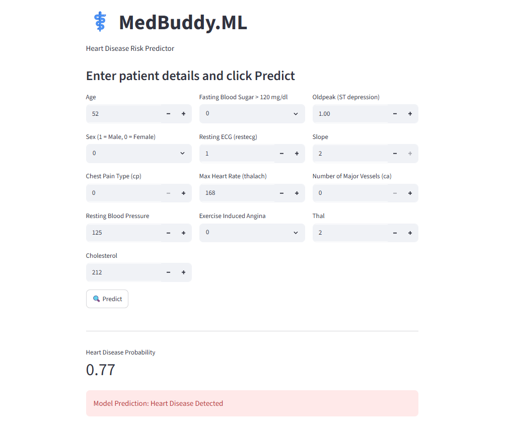

# ⚕️ MedBuddy.ML – Heart Disease Risk Prediction App

MedBuddy.ML is an end-to-end Machine Learning application that predicts the risk of heart disease based on patient health information. 
The project combines a Random Forest Classifier model, a FastAPI backend, and a Streamlit frontend to provide real-time predictions through an interactive web interface.

---

##  Project Overview

This project focuses on predicting whether a patient is likely to have heart disease using clinical and medical attributes such as age, cholesterol level, blood pressure, chest pain type, maximum heart rate, fasting blood sugar, exercise-induced angina, and other health indicators.

The application allows users to enter patient information through a user-friendly Streamlit interface and receive both the prediction result and the probability of heart disease.

---

##  Objective

- Predict heart disease risk using Machine Learning
- Build a production-style ML pipeline
- Develop a FastAPI backend for serving predictions
- Create an interactive Streamlit frontend
- Provide prediction probability and diagnosis results

---

## 📊 Dataset Information

**Dataset:** Heart Disease Dataset

### Features Used

- Age
- Sex
- Chest Pain Type (cp)
- Resting Blood Pressure (trestbps)
- Cholesterol (chol)
- Fasting Blood Sugar (fbs)
- Resting ECG (restecg)
- Maximum Heart Rate (thalach)
- Exercise Induced Angina (exang)
- Oldpeak
- Slope
- Number of Major Vessels (ca)
- Thal

### Target Variable

- Target (Heart Disease: Yes/No)

---

##  Machine Learning Workflow

### 1. Data Preprocessing

- Loaded and validated dataset
- Separated features and target variable
- Applied GroupShuffleSplit to prevent data leakage
- Performed train-test split
- Applied StandardScaler using Scikit-learn Pipeline

### 2. Model Building

- Random Forest Classifier
- Hyperparameter tuning using optimized parameters
- Pipeline-based training workflow

### 3. Model Evaluation

- Accuracy Score
- Recall Score
- F1 Score
- Classification Report

### 4. Model Deployment

- Trained model saved using Joblib
- FastAPI used for serving predictions
- Streamlit used for user interface

---

##  Application Features

• Interactive Streamlit Web Interface

• Real-Time Heart Disease Prediction

• Prediction Probability Score

• FastAPI REST API Backend

• Trained Model Loading & Inference

• Logging and Environment Configuration

---

## 📸 Application Preview



---

## 🔍 Example Prediction

**Heart Disease Probability:** 0.77

**Model Prediction:** Heart Disease Detected

---

## ⚙️ Technologies Used

- Python
- Pandas
- NumPy
- Scikit-learn
- Random Forest Classifier
- FastAPI
- Streamlit
- Joblib
- Requests
- Python-dotenv

---

## 📂 Project Structure

```text
Med_buddy_ml/
│
├── assets/
│   └── medbuddy_ui.png
│
├── backend/
│   ├── main.py
│   ├── predictor.py
│   └── training.py
│
├── frontend/
│   └── app.py
│
├── dataset/
│   └── heart.csv
│
├── notebook_files/
│   └── med_buddy_ml.ipynb
│
├── requirements.txt
├── env_template.txt
├── .gitignore
└── README.md
```

---


## 💡 Key Learnings

- End-to-End Machine Learning Workflow
- Data Preprocessing & Feature Engineering
- Model Training and Evaluation
- Scikit-learn Pipelines
- FastAPI Development
- Streamlit Application Development
- Model Deployment Concepts
- REST API Integration

---

## ⚠️ Disclaimer

This project is created for educational purposes only and should not be used as a substitute for professional medical advice, diagnosis, or treatment.

---

## 🤝 Contributing

Feel free to fork this repository and improve the project.

---

## ⭐ Support

If you found this project useful, consider giving it a star on GitHub!

🔗 Repository: https://github.com/riddhibhuva25/MedBuddy_ML
